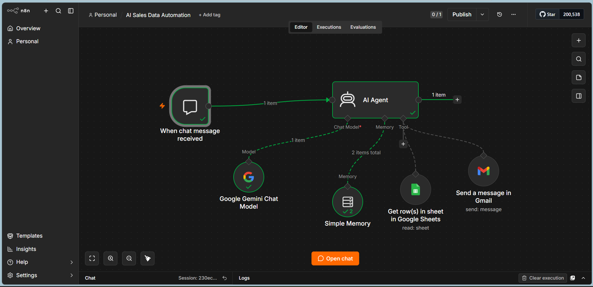
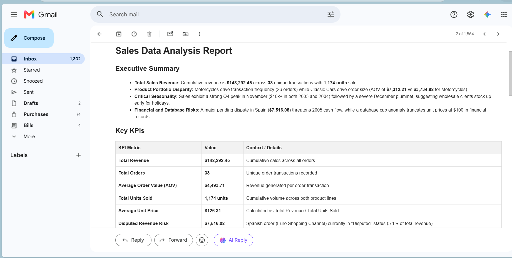

# AI Data Analyst Agent — n8n + Google Gemini

An autonomous AI agent that turns raw spreadsheet data into business 
insights — end to end, without manual analysis.

## What It Does
- Pulls live data from Google Sheets
- Analyzes sales/business data — KPIs, trends, top and underperforming areas
- Remembers context across conversations (multi-turn memory)
- Generates insights and actionable recommendations
- Automatically sends the full report via Gmail

## Screenshots

### Workflow Architecture

## Sample Output

## Tech Stack
- n8n — Workflow & Agent Automation
- Google Gemini — AI / Chat Model
- Google Sheets — Data Source
- Simple Memory — Conversation Memory
- Gmail — Automated Report Delivery

## What I Learned
- AI Agent architecture and how agents call tools
- Prompt engineering — making responses sound like a real analyst, 
  not a generic chatbot
- How memory works in multi-step AI workflows
- Connecting AI Agents with real-world tools (Sheets, Gmail)

## How to Use
1. Import the `.json` file into your n8n instance
2. Connect your Google Sheets and Gmail credentials
3. Add your Google Gemini API key
4. Run the workflow to generate automated business reports

## Demo Video
Coming soon

## Author
Aditya Patidar
